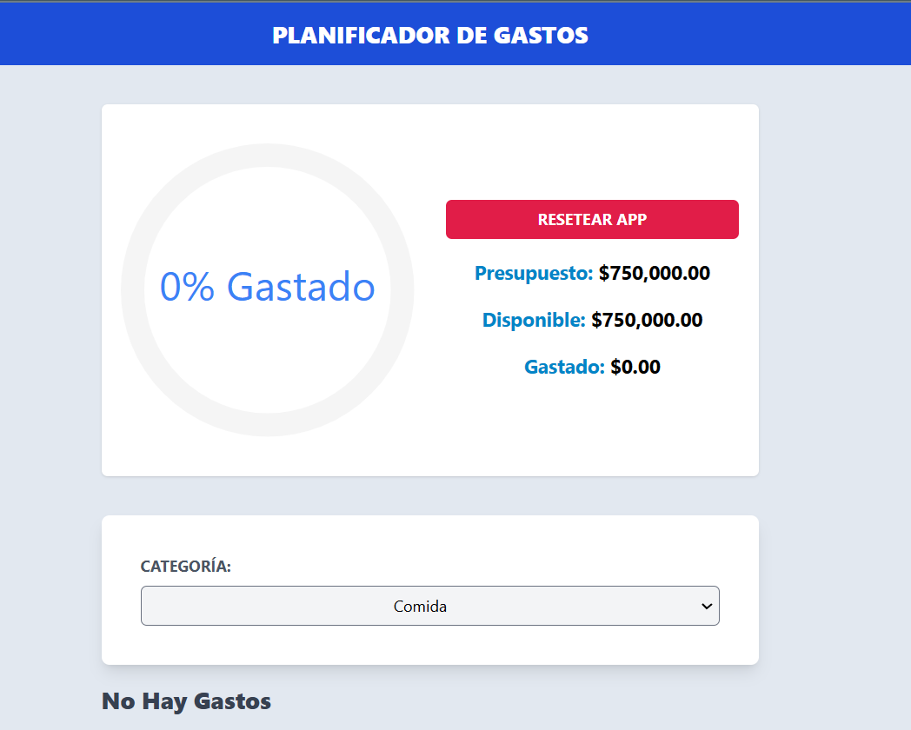

<!-- Banner -->


# 👋 ¡Hola gracias por visitar mi Proyecto!

## 🚀 Proyecto: Planificador de Gastos

Este es el frontend de **Planificador de Gastos**, una aplicación web diseñada para gestionar y planificar tus finanzas personales de manera eficiente. Con esta aplicación, puedes agregar, categorizar y visualizar tus gastos, así como monitorear tu presupuesto en tiempo real.

## 🛠️ Tecnologías Utilizadas

- **React**: Librería para construir interfaces de usuario.
- **useContext** y **useReducer**: Para la gestión avanzada del estado global.
- **localStorage**: Para la persistencia de datos del usuario.
- **React Swipeable List**: Librería para crear listas deslizables, mejorando la experiencia de usuario en dispositivos móviles.
- **React Circular Progressbar**: Librería para visualizar el progreso del presupuesto de manera gráfica.
- **Tailwind CSS**: Framework de CSS para estilizar la aplicación.
- **TypeScript**: Un superset de JavaScript que añade tipos estáticos.

## 🎥 Prueba la Aplicación

Puedes probar la aplicación en vivo visitando [este enlace en Netlify](https://planificador-gastosts.netlify.app/).

## 📝 Funcionalidades Principales

- **Agregar y Categorizar Gastos**: Permite a los usuarios agregar nuevos gastos y categorizarlos para un mejor seguimiento.
- **Visualización del Presupuesto**: Muestra gráficamente el progreso del presupuesto utilizando `React Circular Progressbar`.
- **Gestión de Gastos**: Los gastos se pueden ver en una lista deslizable, con opciones para editar o eliminar cada gasto utilizando `React Swipeable List`.
- **Persistencia de Datos**: Los datos se almacenan en `localStorage` para que persistan entre sesiones del usuario.

## 📂 Estructura del Proyecto

```bash
src/
├── components/       # Componentes reutilizables
├── context/          # Gestión del estado global con useContext y useReducer
├── data/             # Los datos de las categorias
├── helpers/          # Funciones utilitarias y helpers
├── hooks/            # Custom Hooks para lógica reutilizable
├── reducers/         # Gestión del estado global con useContext y useReducer
└── types/            # Types de los datos
```
## 🚀 Cómo Empezar
1. Clona el repositorio:

```bash
git clone https://github.com/RodrigoLoboDev/Planificador_Gastos
```
2. Instala las dependencias:

```bash
npm install
```

3. Inicia el servidor de desarrollo:

```bash
npm run dev
```

## 🤝 Contribuciones
Las contribuciones son bienvenidas. Si tienes ideas para mejorar el proyecto, no dudes en abrir un issue o hacer un pull request.

## 📧 Contacto
- Email: rolobo2812@gmail.com
- LinkedIn: [Jesús Luis Rodrigo Lobo](https://www.linkedin.com/in/jes%C3%BAs-luis-rodrigo-lobo-6594a81b4/)
- GitHub: [RodrigoLoboDev](https://github.com/RodrigoLoboDev)

#### ⭐️ Si te gusta lo que hago, no dudes en seguirme y contribuir a mis proyectos. ⭐️